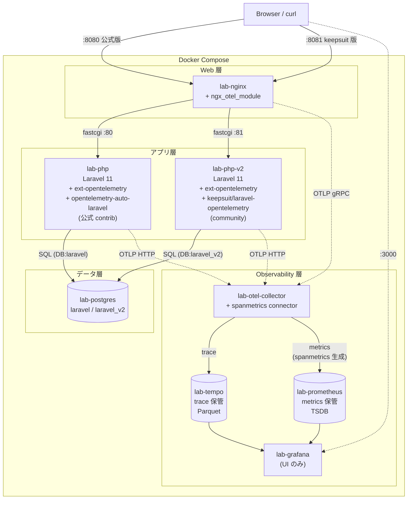
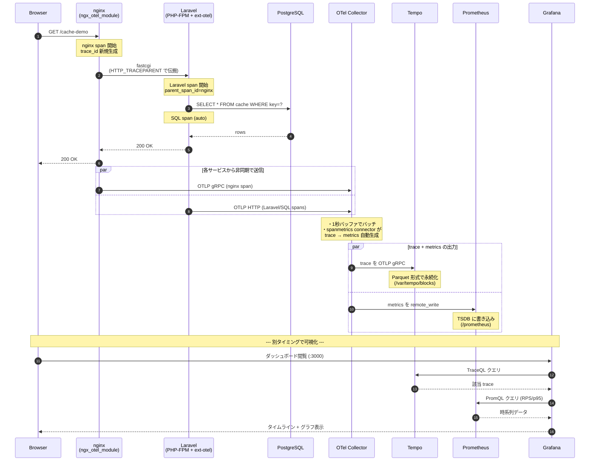
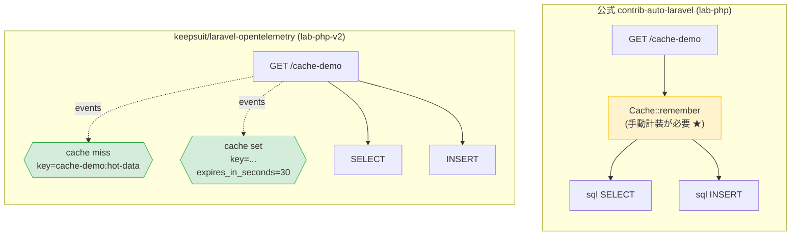
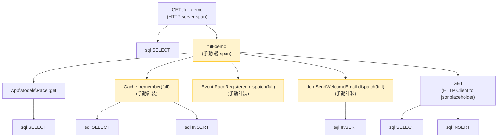
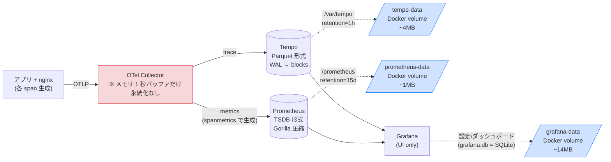

# Laravel での OpenTelemetry 計装検証

> Laravel に OpenTelemetry を入れる時、**公式 contrib-auto-laravel と community keepsuit/laravel-opentelemetry のどちらを選ぶか** を実機で見比べるための Docker Compose 検証環境。nginx (ngx_otel_module) + PHP-FPM (ext-opentelemetry) + PostgreSQL + OTel Collector + Tempo + Prometheus + Grafana のフルスタック。


**Observability スタック**


**Laravel auto-instrumentation 比較**


---

Docker compose で **OpenTelemetry の動作を一通り体験**できるラボ環境。
**公式 contrib-auto-laravel** と **community keepsuit/laravel-opentelemetry** の **2 つの実装を並列で動かして比較**できる構成。

## 全体アーキテクチャ



## リクエスト発生から Grafana 可視化までのシーケンス



## 公式 contrib vs keepsuit の span 構造比較

同じ `GET /cache-demo` リクエストが、両者でどう trace 化されるかの差。



```
[公式]  細かく独立 span を生やす流儀
       → Cache/Event は auto では出ない、手動計装ヘルパーで補う
[keepsuit] 親 span の events として記録する流儀
       → Cache/Event は key/hit/miss/TTL まで auto で取れる
```

## /full-demo の trace hierarchy (公式版)

1 リクエストで全カテゴリの span が出る `/full-demo` の階層構造。



→ 黄色は手動計装 (web.php の `traced(...)` ヘルパーで作っているもの)、それ以外は auto。

## 観測データの保存先



```
Browser
  │
  ├──→ http://localhost:8080  (公式 contrib-auto-laravel)
  │      lab-nginx :80 → lab-php → DB:laravel
  │      service.name = "laravel-app"
  │
  └──→ http://localhost:8081  (community keepsuit/laravel-opentelemetry)
         lab-nginx :81 → lab-php-v2 → DB:laravel_v2
         service.name = "laravel-app-keepsuit"

両方とも → lab-otel-collector → lab-tempo (trace)
                              → lab-prometheus (metrics)
                              → lab-grafana (UI)
```

## できること

- **同じデモエンドポイント**を両実装で叩いて、span 構造の違いを並べて見られる
- 公式は「細かく独立 span を生やす」、keepsuit は「親 span に events として集約」の流儀差
- Grafana の TraceQL で `service.name="laravel-app"` と `service.name="laravel-app-keepsuit"` を切替

## 必要なもの

- Docker Desktop (Apple Silicon / Intel どちらでも)
- 8 GB 程度の空きメモリ

## セットアップ

```bash
cd ~/Desktop/laravel-otel-lab
./setup.sh                                              # Laravel 2 つ作成 + パッケージ追加 + デモコード配置
docker compose up -d --build                            # 8 コンテナ起動 (初回 10-15 分)
docker compose exec php    composer install             # lab-php  (公式) の vendor
docker compose exec php-v2 composer install             # lab-php-v2 (keepsuit) の vendor
docker compose exec php-v2 php artisan vendor:publish --tag=opentelemetry-config
docker compose exec php    php artisan migrate --seed --force
docker compose exec php-v2 php artisan migrate --seed --force
```

## アクセス先

| URL | 内容 |
|---|---|
| http://localhost:8080/         | Laravel (公式 contrib-auto-laravel) |
| http://localhost:8081/         | Laravel (keepsuit/laravel-opentelemetry) |
| http://localhost:3000/         | **Grafana** (匿名 Admin) |
| http://localhost:3200/         | Tempo HTTP API |
| http://localhost:9090/         | Prometheus |
| http://localhost:4318/         | OTel Collector OTLP/HTTP |

## デモエンドポイント (両方の URL に存在)

| エンドポイント | 内容 |
|---|---|
| `/`             | hello |
| `/races`        | 全 race 取得 (DB クエリ) |
| `/races/1`      | 1件取得 |
| `/api-fanout`   | 外部 API 3 本並列呼び出し |
| `/cache-demo`   | `Cache::remember` |
| `/event-demo`   | `Event::dispatch(RaceRegistered)` → Listener 実行 |
| `/job-demo`     | `Queue::dispatch(SendWelcomeEmail)` (sync driver) |
| `/artisan-demo` | `Artisan::call('cache:clear')` |
| `/full-demo`    | 上記全部を 1 リクエストで叩く |

## 公式 contrib vs keepsuit — 取れる情報の違い

| カテゴリ | 公式 contrib (lab-php) | keepsuit (lab-php-v2) |
|---|---|---|
| HTTP route | ✅ `GET /races/{id}` 独立 span | ✅ `GET /races` 独立 span |
| Eloquent モデル | ✅ `App\Models\Race::find` 独立 span | ❌ 独立 span なし (SQL レベルで見える) |
| SQL | ✅ `sql SELECT` (sql プレフィックス付) | ✅ `SELECT` (プレフィックス無し) |
| HTTP Client | ✅ `GET` 独立 span | ✅ `GET` 独立 span |
| Artisan | ✅ `Command migrate` 独立 span | ✅ `Command migrate` 独立 span |
| Queue Job | △ Hook はあるが span 出ず | ✅ `process sync` 独立 span (Worker 処理) |
| **Cache** | ❌ **手動計装必要** | ✅ **親 span の events として auto** (key/hit/miss/TTL) |
| **Event** | ❌ **手動計装必要** | ✅ **親 span の events として auto** |
| `app bootstrap` | ❌ なし | ✅ Laravel ブート全体を span 化 |

### 流儀の違い

```
[公式 contrib の流儀]                  [keepsuit の流儀]
────────────────────                    ───────────────────
細かく独立 span を生やす                親 span に events で集約

GET /cache-demo                         GET /cache-demo
├ Cache::remember (手動)                ├ Events:
│  └ sql SELECT                         │   - cache miss key=...
│  └ sql INSERT                         │   - cache set  key=... ttl=30s
└ ...                                   └ sql SELECT (database cache backend)
                                        └ sql INSERT
```

## トレースの確認手順

1. トラフィック発生:
   ```bash
   for i in 1 2 3; do
     curl -s http://localhost:8080/cache-demo > /dev/null  # 公式
     curl -s http://localhost:8081/cache-demo > /dev/null  # keepsuit
   done
   ```

2. Grafana <http://localhost:3000>
3. **Explore** → Tempo → Search
4. **Service Name** で `laravel-app` (公式) または `laravel-app-keepsuit` を選んで比較

### 比較 TraceQL クエリ

```traceql
# 公式の Cache::remember (手動計装スパン)
{ resource.service.name="laravel-app" && name="Cache::remember" }

# keepsuit の Cache events 付き親 span
{ resource.service.name="laravel-app-keepsuit" && name="GET /cache-demo" && events.name="cache miss" }
```

## ハマりどころ

### スパンが Grafana に来ない

```bash
# 1. PHP コンテナ内で ext-opentelemetry が読まれてるか
docker compose exec php    php -m | grep opentelemetry
docker compose exec php-v2 php -m | grep opentelemetry

# 2. 環境変数が PHP-FPM プロセスに渡ってるか
docker compose exec php    sh -c 'env | grep ^OTEL_'
docker compose exec php-v2 sh -c 'env | grep ^OTEL_'

# 3. Collector のログでスパンが届いてるか
docker compose logs -f otel-collector
```

特に `OTEL_PHP_AUTOLOAD_ENABLED=true` が抜けてると一切動かないので注意。

### nginx で `unknown directive "otel_..."`

`nginx-module-otel` パッケージが入っていないか、`load_module modules/ngx_otel_module.so;` が `nginx.conf` の最上部にない。

### Docker for Mac の bind mount で inode が変わると同期しないことがある

ファイルを Edit ツール（atomic rename）で更新したあと nginx で反映されない時は `docker compose restart nginx` で対処。

## 構成ファイル

```
.
├── docker-compose.yml          # 8 サービス定義
├── README.md
├── setup.sh                    # laravel/ と laravel-v2/ を両方セットアップ
│
├── nginx/
│   ├── Dockerfile              # 公式 nginx + nginx-module-otel
│   ├── nginx.conf              # otel_exporter / otel_trace 等
│   ├── conf.d/default.conf     # :80 → lab-php (laravel)
│   └── conf.d/v2.conf          # :81 → lab-php-v2 (laravel-v2)
│
├── php/                        # PHP 8.4-fpm + pecl opentelemetry (両 PHP コンテナで共用)
│   ├── Dockerfile
│   ├── conf.d/zz-otel.ini
│   └── php-fpm.d/www.conf
│
├── postgres/init-multi-db.sh   # laravel と laravel_v2 の 2 つの DB を作成
│
├── otel/otel-collector-config.yaml  # spanmetrics connector 含む
├── tempo/tempo.yaml
├── prometheus/prometheus.yml
│
├── grafana/
│   ├── provisioning/datasources/{tempo,prometheus}.yml
│   ├── provisioning/dashboards/default.yml
│   └── dashboards/
│       ├── overview.json           # 全体トレース一覧
│       ├── http-metrics.json       # RPS / latency / error rate
│       └── categories.json         # カテゴリ別 (HTTP/SQL/Cache/Event/...)
│
├── stubs/                      # setup.sh が Laravel にコピーするデモコード
│   ├── web.php                 # 公式版 (手動計装ヘルパー込み)
│   ├── web-keepsuit.php        # keepsuit 版 (手動計装ナシ、純粋 auto)
│   ├── Race.php
│   ├── RaceSeeder.php
│   ├── DatabaseSeeder.php
│   ├── migration_create_races.php
│   ├── RaceRegistered.php      # Event
│   ├── SendWelcomeEmail.php    # Job
│   ├── NotifyParticipants.php  # Listener
│   └── AppServiceProvider.php  # Event::listen 登録
│
├── laravel/                    # setup.sh が生成、公式 contrib 適用
└── laravel-v2/                 # setup.sh が生成、keepsuit 適用
```

## クリーンアップ

```bash
docker compose down -v                              # コンテナと named volume を全部削除
rm -rf laravel laravel-v2                           # Laravel プロジェクトも消す場合
```

## 観測データの保存先

| サービス | 保存内容 | サイズ実測 | 保持期間 (現ラボ) |
|---|---|---|---|
| Tempo (`tempo-data`) | 全 trace (Parquet 形式) | 〜5MB | **1 時間** ← `tempo/tempo.yaml` で変更可 |
| Prometheus (`prometheus-data`) | 全 metrics (TSDB) | 〜2MB | 15 日 (デフォルト) |
| Grafana (`grafana-data`) | 設定/ダッシュボード (SQLite) | 〜14MB | 永続 |
| Postgres (`postgres-data`) | アプリ DB (races テーブル等) | 〜70MB | 永続 |

Docker volume なのでコンテナ再起動しても残ります。`docker compose down -v` (`-v` flag) で初めて消える。
